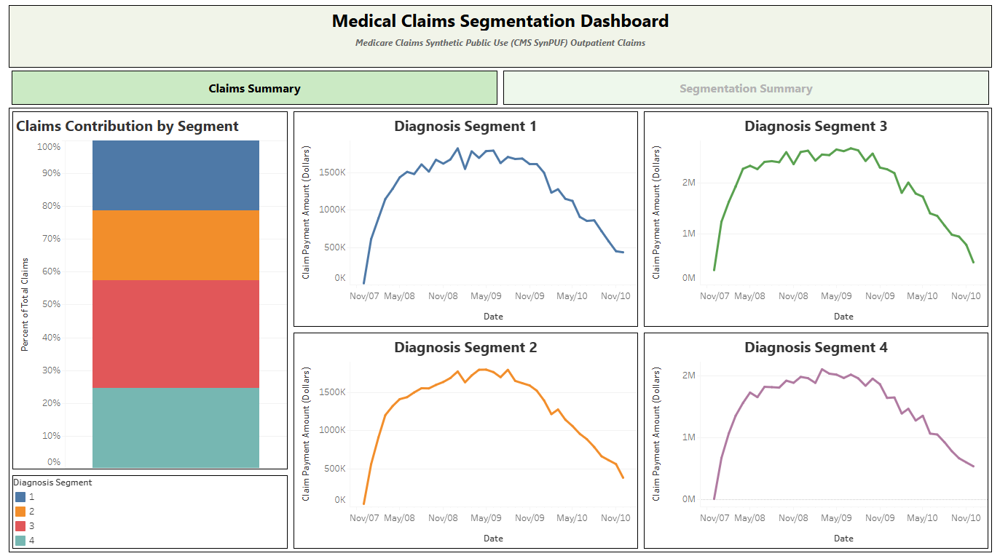
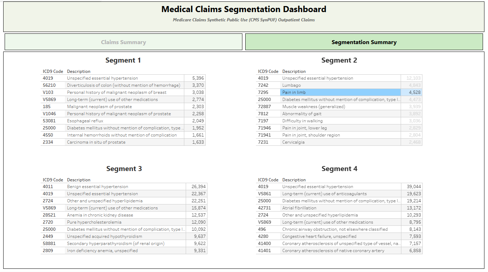

# SynPUF Outpatient Claims Dashboard

## Summary
This project seeks to leverage the [Medicare Claims Synthetic Public Use Files (SynPUFs)](https://www.cms.gov/data-research/statistics-trends-and-reports/medicare-claims-synthetic-public-use-files) provided by CMS to perform a combination of exploratory analysis, dashboarding, and ML-based segmentation of medical claims. As this is a synthetic resource, this allows for us to maintain data privacy while exploring various analytics techniques for this type of data. 

In this inference, we ingest synthetic outpatient claims provided by CMS, along with a data dictionary of ICD-9 diagnosis codes. Note that the SynPUF data simulates older claims histories, when ICD-9 was still the common standard in the United States. We then seek to characterize and segment claims histories by means of Word2Vec embeddings. These embeddings allow us to then fit a KMeans clustering model to the data, grouping claims into 4 categories. Ideally, these categories offer semantic understanding into the types of claims beyond the inherent categorization in diagnosis coding standards.

## Data Product

### Outputs
After ingestion and model fitting, each claim is assigned a diagnosis segment. This allows us to produce a table providing total claim payment amounts by month and by segment. Furthermore, we are able to then characterize each segment by listing the top 10 diagnosis codes founds in each cluster. In this inference, we can roughly describe the following segments:

Segment 1: Neoplasms

Segment 2: Musculoskeletal

Segment 3: Hypertension with renal complications

Segment 4: Hypertension with cardiac complications


### Dashboard

To assist with visualization, a Tableau public dashboard has been created for this project. The dashboard includes time series summaries of claim amounts broken out by segment. A second tab allows for the inspection of the most common diagnoses in each segment. This dashboard can be viewed at https://public.tableau.com/app/profile/andrew.cockerill/viz/MedicalClaimsDashboardSynPUF/ClaimsSummary.





### How to Use

To reproduce this inference, the project can first be cloned/downloaded via git. The Python dependencies can then be installed in a custom environment (this was developed using Python 3.11).

```
pip install -r requirements.txt
```

From here, the user can then execute two scripts after navigating to <tt>src/python</tt>. Project parameters can be modified using the JSON files within the <tt>configs</tt> folder.

Step 1: Downloads and saves SynPUF and ICD-9 lookups as sqlite3 tables
```
python ingest_raw_data.py
```

Step 2: Builds embedding and clustering models, pushing segmentation summary tables to sqlite3
```
python build_model.py
```